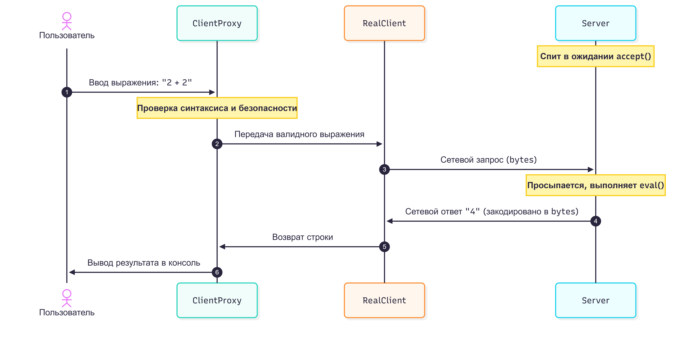

# Как с этим работать

Запустите сервер в терминальном окне:

```Bash
python server.py
```

запустите клиента в другом терминальном окне:

```Bash
python client.py
```

## Примеры тестов в клиенте

`2 + 2 * 2` -> Вернет 6 (запрос ушел на сервер).

`10 / 0` -> Вернет Ошибка [Сервер]: Деление на ноль! (прокси пропустил, упало на сервере).

`2 + abc` -> Вернет Ошибка [Proxy]... (прокси заблокировал, сервер запрос даже не получал).

`import os; os.system('clear')` -> Вернет Ошибка [Proxy]... (заблокировано прокси, Ура, хакер не пройдет!).

## ⚙️ Процесс обработки запросов (Жизненный цикл Клиент-Сервер)

### 1. Инициализация и режим ожидания (Сервер)

* При запуске `server.py` создается TCP-сокет, который привязывается к адресу `127.0.0.1:65432` (`bind`).
* Метод `server_socket.listen()` переводит сервер в режим прослушивания сети.
* Вызов `server_socket.accept()` является **блокирующим**. В этот момент сервер «засыпает» (переходит в режим ожидания подключения). Он не потребляет ресурсы процессора в пустом цикле, а делегирует ожидание операционной системе.

### 2. Подключение и отправка (Клиент & Proxy)

1. **Ввод данных:** Пользователь вводит строку (например, `2 + 2`) в консоли клиента.
2. **Перехват через Proxy:** Запрос передается не в сеть, а в объект `ClientProxy`.
3. **Локальная валидация:** * Proxy проверяет строку регулярным выражением на отсутствие опасных символов.
   * Proxy компилирует строку через `compile(..., 'eval')` для проверки синтаксиса.
   * **Если данные некорректны:** Proxy возвращает клиенту сообщение об ошибке, экономя сетевой трафик. Запрос до сервера **не доходит**.
4. **Сетевой вызов:** Если проверка пройдена, Proxy передает строку в `RealClient`, который кодирует её в байты (`utf-8`) и отправляет через метод `sendall()`.

### 3. Обработка на стороне сервера

* Как только клиент подключается, блокирующий метод `accept()` на сервере «просыпается» и возвращает сокет соединения (`conn`) для работы с конкретным клиентом.
* Сервер вызывает блокирующий метод `conn.recv(1024)`. Он снова «засыпает» до тех пор, пока от клиента не придут байты данных.
* **Вычисление (`eval`):** Получив байты, сервер декодирует их в строку и передает в метод `_calculate()`.
  * Выражение обрабатывается через `eval(expression, {"__builtins__": None}, {})`. Сброс встроенных функций (`__builtins__`) служит вторым рубежом защиты.
  * Метод обрабатывает исключения (например, `ZeroDivisionError` при делении на ноль).

### 4. Возврат ответа и закрытие сессии

* Результат вычислений или текст ошибки (если упал `eval`) кодируется в байты и отправляется обратно клиенту через `conn.sendall()`.
* Сервер снова возвращается к началу цикла `recv()` и ждет следующую команду от этого же клиента.
* Если клиент вводит `exit`, сокет закрывается на стороне клиента. Сервер получает пустые байты (`b''`), выходит из цикла чтения текущего клиента и снова засыпает на строке `accept()`, ожидая новых подключений.

---

### 📊 Диаграмма последовательности (Sequence Diagram)


