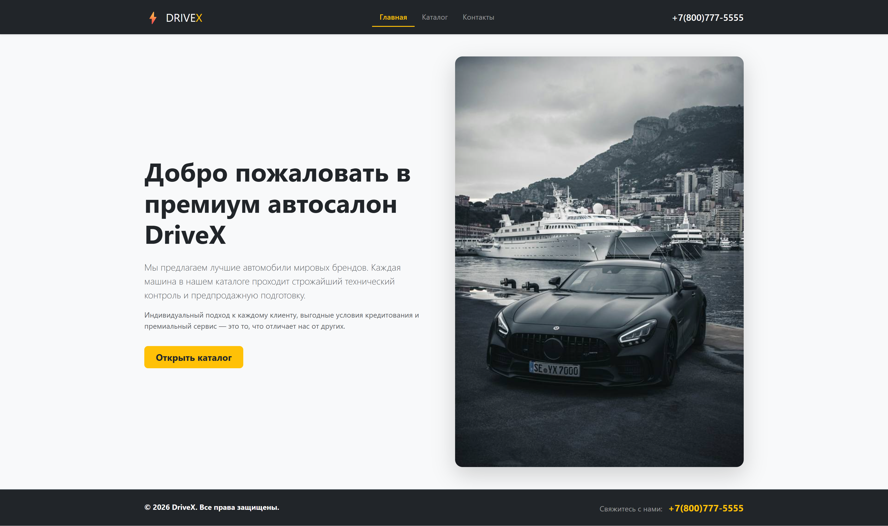
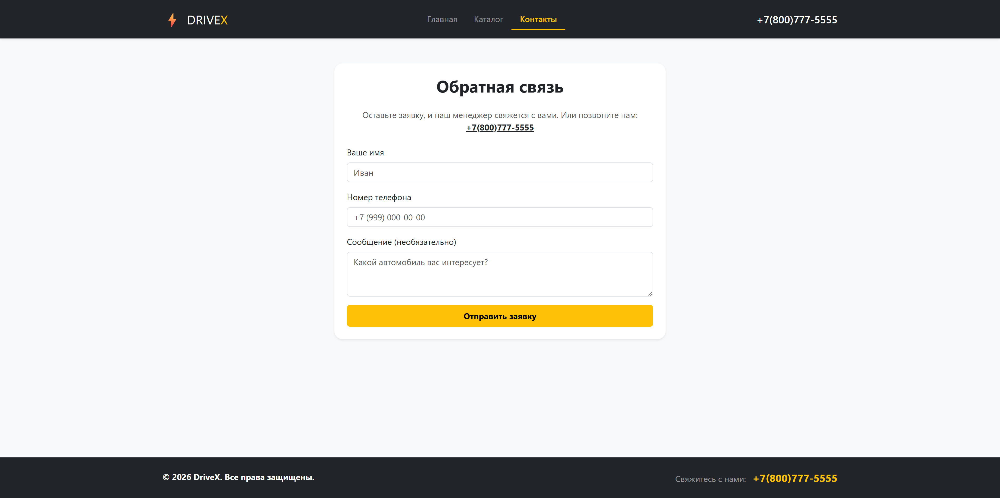
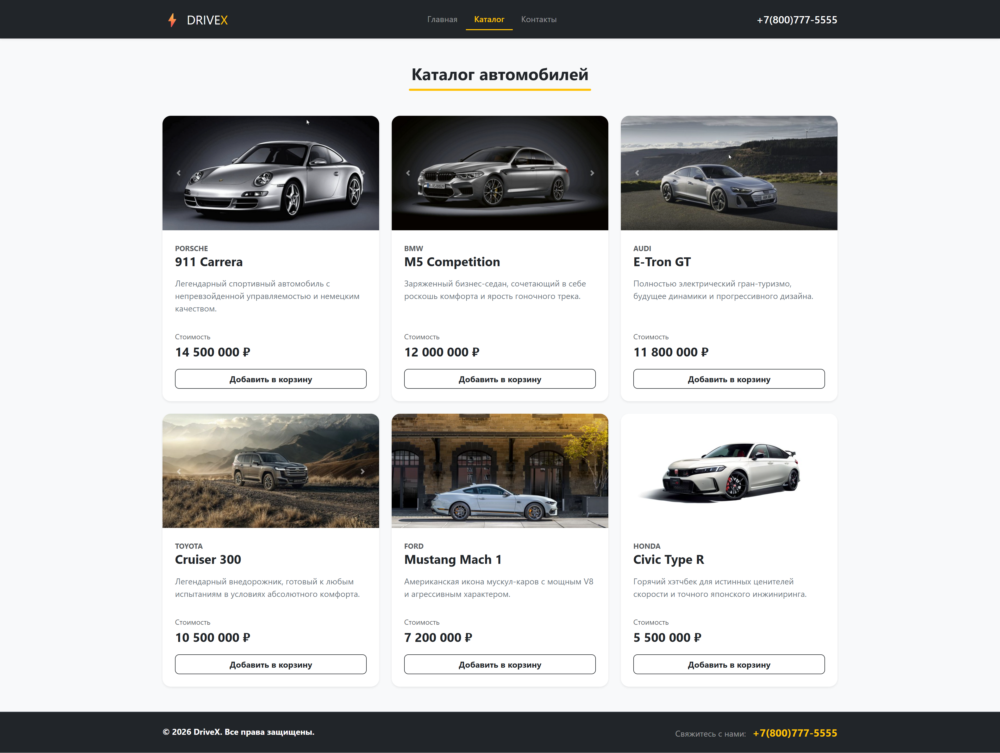
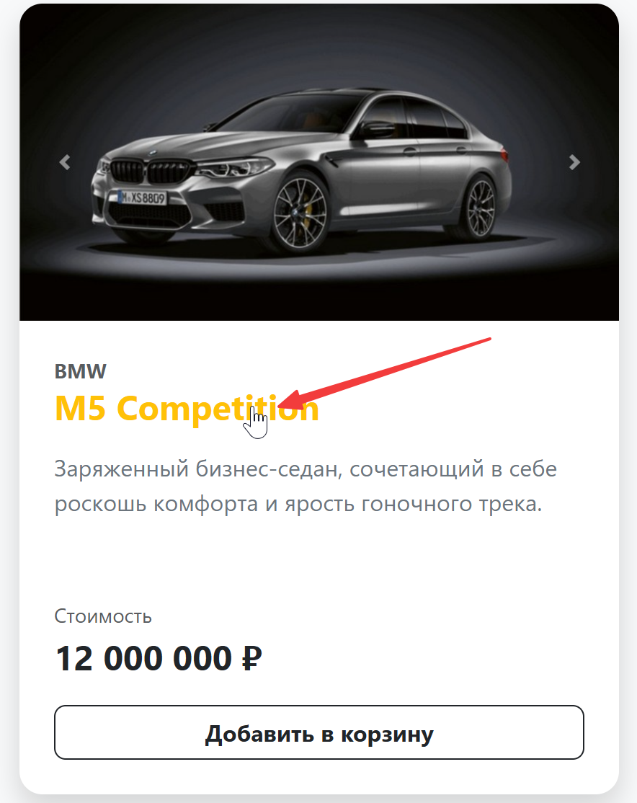
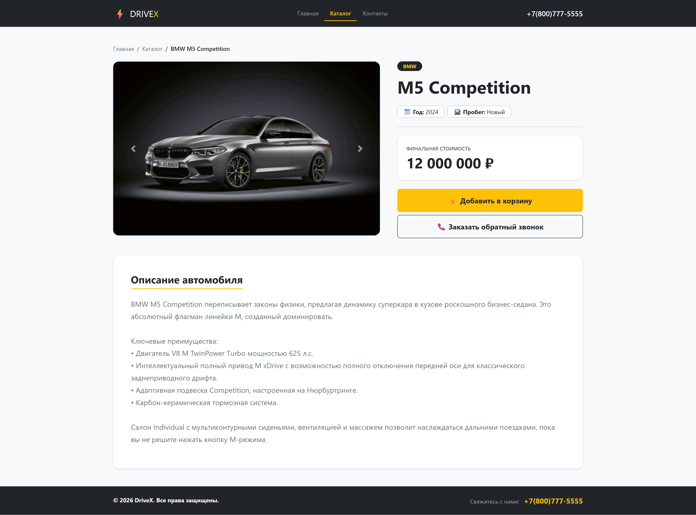

# ДЗ 3.1

## Материалы

код урока в l26_05_18

Разбор ДЗ в видео 3.4 <https://my.mts-link.ru/j/AcademySL/pp_python-devsecops/record-new/19410065662>
на 05:54

## Инфраструктура

```bash
cd /home/vp/code/learn-python/m3_1hw
cd /home/vp/code/learn-python/m3_1hw/.infra/postgres

docker compose up -d

#  удаляет именованные тома
docker compose down -v
```

## Как выглядит результат



---



---



---



---

